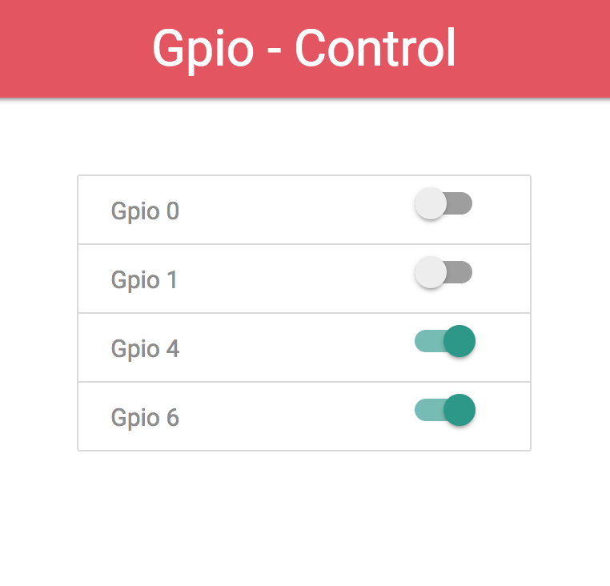

<h1>Simple interface to control Raspberry Gpio using ajax.</h1> 

Just have to edit index.php, then add label and gpio number: 
<code>$gpios = [ 
    'Gpio 0' => 0, 
    'Gpio 1' => 1, 
    'Gpio 4' => 4, 
    'Gpio 6' => 6 
];</code>

